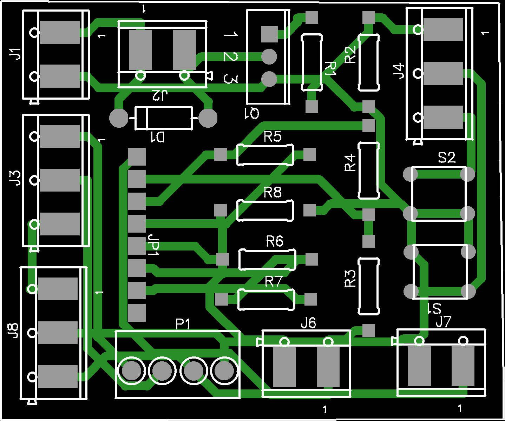
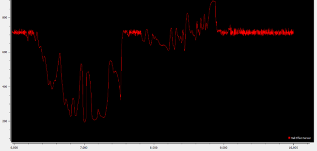
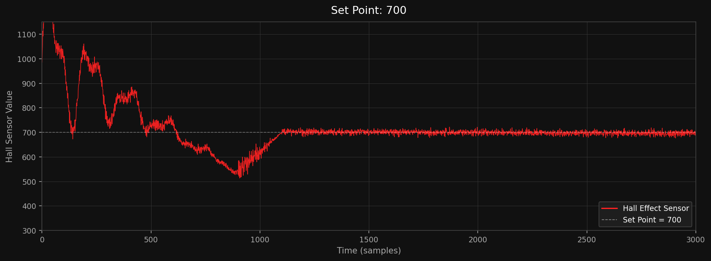
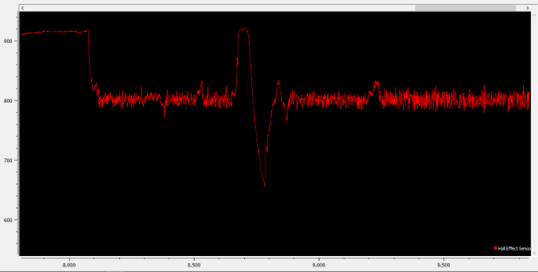

# Magnetic Levitator with PID Controller


**Digital Control — Final Project | Universidad Anáhuac Mayab, 2021**

A magnetic levitation system that suspends a permanent magnet in mid-air using an electromagnet controlled by a discrete PID algorithm running on Arduino hardware.

📹 **[Demo Video](https://www.youtube.com/watch?v=btzwbzjfru0)**

---

## Overview

The system uses a **Hall effect sensor** to measure the magnetic field intensity of a floating permanent magnet and feeds that reading back into a PID controller. The controller adjusts the PWM signal driving an electromagnet to maintain the magnet at a desired levitation height (set point).

Three pre-calibrated levitation set points are available, selectable via a 4×3 keypad, with real-time feedback displayed on a 16×2 LCD screen.

---

## System Architecture

Due to hardware constraints (I/O and library conflicts), the system was split across **two microcontrollers** communicating via digital I/O pins:

```
┌─────────────────────────┐        Digital pins         ┌──────────────────────────┐
│      Arduino UNO        │ ◄────────────────────────   │      Arduino Nano        │
│                         │                             │                          │
│  • Hall effect sensor   │                             │  • 4×3 Keypad input      │
│  • PID control loop     │                             │  • 16×2 LCD I2C display  │
│  • PWM → Electromagnet  │                             │  • Mode/Start signals    │
└─────────────────────────┘                             └──────────────────────────┘
```

---

## PID Controller

The controller runs a standard discrete PID implementation:

| Parameter | Value |
|-----------|-------|
| Kp        | 1.0   |
| Ki        | 0.3   |
| Kd        | 0.65  |
| dt        | 0.1 s |

```
output = (-Kp × error) + (-Ki × integral) + (-Kd × derivative)
```

The output is clamped to the 8-bit PWM range `[0, 255]` and written to the electromagnet driver.

### Levitation Set Points

| Mode   | Set Point | Description                  |
|--------|-----------|------------------------------|
| Mode 1 | 649       | Closest to electromagnet     |
| Mode 2 | 700       | Mid-range levitation height  |
| Mode 3 | 730       | Furthest levitation height   |

---

## Hardware

### Components

- Arduino UNO (PID controller)
- Arduino Nano (UI controller)
- Hall effect sensor (analog)
- Electromagnet
- MOSFET / transistor driver circuit
- 4×3 matrix keypad
- 16×2 LCD with I2C backpack (address `0x27`)
- Custom PCB (Gerber files included)
- Permanent magnet (levitating object)

### Pin Mapping

**Arduino UNO (PID)**

| Pin  | Function                     |
|------|------------------------------|
| A0   | Hall effect sensor input     |
| D6   | PWM output to electromagnet  |
| D9   | Sub (set point −) button     |
| D10  | Add (set point +) button     |
| D2   | Start/Stop signal (from Nano)|
| D3   | Mode 1 signal (from Nano)    |
| D4   | Mode 2 signal (from Nano)    |
| D5   | Mode 3 signal (from Nano)    |

**Arduino Nano (UI)**

| Pin     | Function                     |
|---------|------------------------------|
| A0      | Hall effect sensor (display) |
| D2–D8   | Keypad rows/columns          |
| D9      | Start/Stop signal (to UNO)   |
| D10     | Mode 1 signal (to UNO)       |
| D11     | Mode 2 signal (to UNO)       |
| D12     | Mode 3 signal (to UNO)       |
| SDA/SCL | LCD I2C                      |

---

## Repository Structure

```
pid-magnetic-levitator/
├── firmware/
│   ├── arduino_uno/
│   │   └── PID.ino                          # PID control loop (Arduino UNO)
│   └── arduino_nano/
│       └── LCD_KeyPad.ino                   # Keypad & LCD interface (Arduino Nano)
├── hardware/
│   └── Gerber_PCB_Magnet_Power.zip          # PCB Gerber files for electromagnet driver
├── graphs/
│   ├── pcb_schematic.png                    # PCB schematic image
│   ├── graph_setpoint_630.png               # Hall sensor response — set point 630
│   ├── graph_setpoint_700.png               # Hall sensor response — set point 700
│   └── graph_setpoint_730.png               # Hall sensor response — set point 730
└── README.md
```

---

## Keypad Controls

| Key | Action                          |
|-----|---------------------------------|
| `1` | Start the system (Mode 1)       |
| `2` | Switch to Mode 1 (set point 649)|
| `3` | Switch to Mode 2 (set point 700)|
| `4` | Switch to Mode 3 (set point 730)|
| `5` | Stop the system                 |

Physical buttons on the UNO allow fine-tuning the set point ±1 while the system is running.

---

## Dependencies

**Arduino Nano sketch:**
- [`Keypad`](https://github.com/Chris--A/Keypad) by Mark Stanley & Alexander Brevig
- [`LiquidCrystal_I2C`](https://github.com/johnrickman/LiquidCrystal_I2C) by Frank de Brabander

Install via Arduino Library Manager or the provided links.

---

## PCB Schematic

Custom PCB designed for the electromagnet power driver circuit. Gerber files are included in `hardware/` for fabrication.



---

## Results

All graphs plot the Hall effect sensor value as a function of time, representing the magnetic field intensity of the permanent magnet. The set points represent the desired intensity to be measured, which corresponds to the distance between the electromagnet and the permanent magnet.

The plots show the initial values as the magnet is brought closer to the electromagnet (visible as large variations), followed by stable levitation where the measured value stays within a narrow range.

### Graph 1 — Set Point: 630


### Graph 2 — Set Point: 700


### Graph 3 — Set Point: 730


---

## Course Info

- **Course:** Digital Control
- **Institution:** Universidad Anáhuac Mayab
- **Student:** Sebastián Mayorga Castro
- **Date:** May 2021
